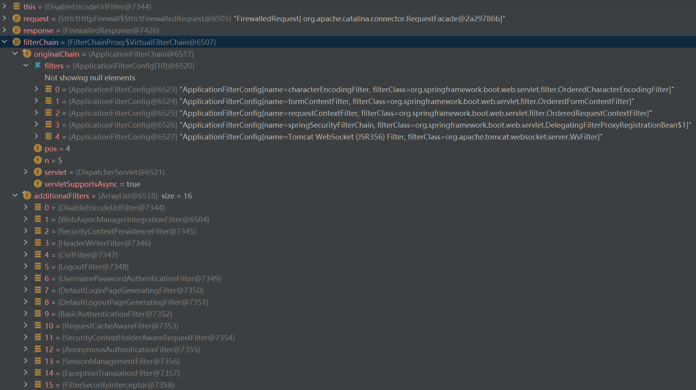

# Architecture
本章节讨论基于 Servlet 的应用程序的 Spring Security 的 high level 体系结构。我们在认证、授权、保护程序不受漏洞攻击章节的基础上理解本节的 high level 体系结构。

## A Review of Filters
Spring Security 的 Servlet 支持基于一系列 Servlet `Filter`s，所以先了解 `Filter`s 的作用对理解 Spring Security 的架构很有帮助。下图展示了单个 HTTP 请求的处理过程的经典分层。

<div style="text-align:center">

<p><em>Figure 1. FilterChain</em></p>
</div>

客户端发送一个请求到应用程序，容器会为这个请求创建包含了 `Filter`s 和 `Servlet` 的 `FilterChain`，它会基于请求 URI 的路径来处理这个 `HttpServletRequest` 。在 Spring MVC 应用中，`Servlet` 是 `DispatcherServlet` 的实例。最多一个 `Servlet` 可以处理单个 `HttpServletRequest` 和 `HttpServletResponse` 。但是可以使用多个 `Filter` 来：
- 防止调用下游 `Filter`s 或 `Servlet`。在这个实例中，`Filter` 通常会编写 `HttpServletResponse` 。
- 修改下游 `Filter`s 和 `Servlet` 使用的 `HttpServletRequest` 或 `HttpServletResponse` 。

`Filter` 的强大能力来自于（作为参数）传递给它的 `FilterChain` 。

*Example 1. `FilterChain` Usage Example*
```Java
public void doFilter(ServletRequest request, ServletResponse response, FilterChain chain) {
	// do something before the rest of the application
    chain.doFilter(request, response); // invoke the rest of the application
    // do something after the rest of the application
}
```
由于 `Filter` 只影响下游的 `Filter`s 和 `Servlet` ，`Filter`s 被调用的顺序就十分重要。

## DelegatingFilterProxy
Spring 提供一个名为 `DelegatingFilterProxy` 的 `Filter` 实现，允许 Servlet 容器生命周期和 Spring `ApplicationContext` 之间的桥接。Servlet 容器可以使用它自己的标准注册 `Filter` ，但是它感知不到 Spring 定义的 Beans 。**`DelegatingFilterProxy` 可以由标准 Servlet 容器机制注册，但将所有工作委托给一个实现了 `Filter` 的 Spring Bean 。**

下图展示了 `DelegatingFilterProxy` 如何加入 `Filter`s 和 `FilterChain` 。

<div style="text-align:center">

<p><em>Figure 2. DelegatingFilterProxy</em></p>
</div>

`DelegatingFilterProxy` 在 `ApplicationContext` 中找到并调用 $Bean$ $Filter_0$ 。`DelegatingFilterProxy` 的伪代码如下：

*Example 2. `DelegatingFilterProxy` Pseudo Code*
```java
public void doFilter(ServletRequest request, ServletResponse response, FilterChain chain) {
	// Lazily get Filter that was registered as a Spring Bean
    // delegate is an instance of Bean Filter0
	Filter delegate = getFilterBean(someBeanName);
	// 将工作交给 Spring Bean
	delegate.doFilter(request, response);
}
```

`DelegatingFilterProxy` 的另一个好处是：它允许延迟查找 `Filter` bean 的实例。这很重要，因为容器需要在启动之前注册 `Filter` 实例，但 Spring 通常使用一个 `ContextLoaderListener` 来加载 Spring Beans，而这一过程需要 `Filter` 实例被注册后才能完成。

> 对上面这段话的个人理解：容器在启动之前需要注册 `Filter` 实例，但是 $Filter_0$ 作为一个 Spring Bean 是在容器启动后被 `ContextLoaderListener` 加载到容器中的。所以 $Filter_0$ 先被注册（可能是注册一个代理？），在容器启动后才被真正加载进来。

## FilterChainProxy
Spring Security 的 Servlet 支持通过 `FilterChainProxy` 实现。`FilterChainProxy` 是 Spring Security 提供的一个特殊的 `Filter` ，它允许通过 `SecurityFilterChain` 将工作委派给一组 `Filter` 实例。由于 `FilterChainProxy` 是一个 Bean ，它通常会被 `DelegatingFilterProxy` 包装。

<div style="text-align:center">

<p><em>Figure 3. FilterChainProxy</em></p>
</div>

## SecurityFilterChain
[`SecurityFilterChain`](https://docs.spring.io/spring-security/site/docs/5.7.3/api/org/springframework/security/web/SecurityFilterChain.html) 被 `FilterChainProxy` 使用来决定哪些 `Filter`s 应该被调用来处理当前的请求。

<div style="text-align:center">

<p><em>Figure 4. SecurityFilterChain</em></p>
</div>

`SecurityFilterChain` 中的 Security Filters 通常是 Bean ，但他们是通过 `FilterChainProxy` 注册的，而不是 `DelegatingFilterProxy` 。

Security Filters 通过 `FilterChainProxy` 注册有很多好处：
- 首先，它为 Spring Security 的支持提供了一个起点。如果你想要排除 Spring Security 的故障，可以从 `FilterChainProxy` 开始加入断点。
- 其次，既然 `FilterChainProxy` 是 Spring Security 使用的核心，它可以选择性地执行一些不可见的任务。比如，它清理 `SecurityContext` 来避免内存泄漏；它还提供 Spring Security 的 `HttpFirewall` 来保护应用程序不受一些类型的攻击。
- 另外，它在选择哪一个 `SecurityFilterChain` 应该被调用的决策上提供更大的灵活性。在一个 Servlet 容器中，仅仅根据 URL 调用 `Filter`s 。但 `FilterChainProxy` 通过利用 `RequestMatcher` 接口可以基于 `HttpServletRequest` 的任何内容决定调用。

事实上，`FilterChainProxy` 可以用来决定哪一个 `SecurityFilterChain` 应该被调用。这允许你为程序的不同切片提供完全独立的配置。

<div style="text-align:center">

<p><em>Figure 5. Multiple SecurityFilterChain</em></p>
</div>

上图中，`FilterChainProxy` 决定使用哪一个 `SecurityFilterChain` 。只有第一个匹配成功的 `SecurityFilterChain` 会被调用。如果请求 URL `/api/messages/` ，它首先匹配到了 $SecurityFilterChain_0$ 的 pattern `/api/**` ，所以只有 $SecurityFilterChain_0$ 会被调用（尽管 $SecurityFilterChain_n$ 也符合匹配条件）。如果请求 URL `/messages/` ，它不匹配 $SecurityFilterChain_0$ 的 pattern `/api/**` ，所以 `FilterChainProxy` 会继续尝试每一个 `SecurityFilterChain` 。假如没有其他 `SecurityFilterChain` 匹配成功，那么 $SecurityFilterChain_n$ 会被调用。

注意 $SecurityFilterChain_0$ 只配置了 3 个 Security Filters 实例，而 $SecurityFilterChain_n$ 配置了 4 个 Security Filters 实例。这个知识点很重要：每一个 `SecurityFilterChain` 都可以是独一无二的且拥有独立的配置。事实上，一个 `SecurityFilterChain` 可以配置 0 个 Security Filter ，这种情况下应用程序希望 Spring Security 忽略特定的请求。

## Security Filters
Scurity Filter 通过 `SecurityFilterChain` 被插入 `FilterChainProxy` 中， Filters 的顺序很重要。下面列出了一个完整的 Spring Security Filter 顺序列表（粗体标记出了默认创建的 Filter ，没有加说明的 filter 未加载进项目，可能需要引入 spring-boot-starter-security 以外的 dependencies ）：
- ForceEagerSessionCreationFilter 
    - 如果 HttpSession 不存在，立刻创建一个出来。
- ChannelProcessingFilter 
    - 确保 web 请求通过所需的通道传递。最常见的用法是确保请求通过 HTTPS 进行，其中 `ChannelDecisionManagerImpl` 配置了 `SecureChannelProcessor` 和 `InsecureChannelProcessor` 。
- **WebAsyncManagerIntegrationFilter**
    - 提供 `SecurityContext` 和 Spring Web 的 `WebAsyncManager` 之间的集成。使用 `SecurityContextCallableProcessingInterceptor.beforeConcurrentHandling(org.springframework.web.context.request.NativeWebRequest, Callable)` 来在 `Callable` 上填充 `SecurityContext` 。
    - `WebAsyncManager` 用于管理异步请求处理的中心类，主要用作SPI，通常不由应用程序类直接使用。
    - 个人理解，给当前请求的 `WebAsyncManager` 注册一个 `SecurityContextCallableProcessingInterceptor` 。该拦截器做以下事情：当调用 `preProcess(NativeWebRequest, Callable)` 时，在 `SecurityContextHolder` 上注入 `SecurityContext` 。当调用 `postProcess(NativeWebRequest, Callable, Object)` 时，清理 `SecurityContextHolder` 。
- **SecurityContextPersistenceFilter**
    - 持久化 `SecurityContext` ，通过 `SecurityContextRepository.saveContext(SecurityContext context, HttpServletRequest request, HttpServletResponse response)` 来完成。
- **HeaderWriterFilter**
    - 向当前响应添加 headers 。添加 headers 来启用相应的浏览器保护是很有用的。比如 `X-Frame-Options` ，`X-XSS-Protection` 和 `X-Content-Type-Options` 。
- CorsFilter
    - 启用客户端跨源请求，按照规范检查每个 `HttpServletRequest` 请求，并将适当的响应头添加到 `HttpServletResponse` 中。
- **CsrfFilter**
    - 启用跨站请求伪造保护。
- **LogoutFilter**
    - 提供 `/logout` API，注销一个 principal 。
    - 轮询一系列 `LogoutHandlers` ，handlers 应该按照它们被需要的顺序指定。通常你会想要调用 logout handlers  `TokenBasedRememberMeServices` 和 `SecurityContextLogoutHandler` (按此顺序)。这些 handlers 做实际的注销操作，例如清理 spring context ， 将 session 置为无效等。
    - 完成注销之后，会执行重定向；重定向的 URL 由配置的 `logoutSuccessHandler` 或 `logoutSuccessUrl` 决定。
- OAuth2AuthorizationRequestRedirectFilter
- Saml2WebSsoAuthenticationRequestFilter
- X509AuthenticationFilter
    - `AbstractPreAuthenticatedProcessingFilter` 的子类。
- AbstractPreAuthenticatedProcessingFilter
    - 处理 pre-authentication 认证请求的 Filter 的基类，这类 Filter 假设 principal 已经通过了外部系统的认证。
    - `AbstractPreAuthenticatedProcessingFilter` 的目的是从请求中提取 principal 的必要信息，而不是认证。外部的认证系统可能会在请求数据中提供这些信息，例如 headers 或 cookies 。假设外部系统会保证数据的准确并且防止伪造数据的提交。
    - 子类需要实现 `getPreAuthenticatedPrincipal()` 和 `getPreAuthenticatedCredentials()` 方法。
    - 该 filter 的子类通常会和一个 `PreAuthenticatedAuthenticationProvider` 组合使用，用来为用户加载额外的数据，这个 provider 会拒绝 null credentials ，所以对一个合法的 principle ，`getPreAuthenticatedCredentials()` 方法应该注意不要返回 null 。
- CasAuthenticationFilter
- OAuth2LoginAuthenticationFilter
- Saml2WebSsoAuthenticationFilter
- **UsernamePasswordAuthenticationFilter**
    - 处理提交的身份验证表单，表单需要包含两个参数：username 和 password (参数名可配置)。
    - 默认情况下响应 URL `/login` 。
- OpenIDAuthenticationFilter
- **DefaultLoginPageGeneratingFilter**
    - 内部使用，与命名空间配置一起，用于用户没有配置登录页面的情况。相反，如果用户配置了登陆页面，将会在 filter chain 中将配置代码插入此 filter 。
    - 仅在使用了重定向到登录页面时有效。
- **DefaultLogoutPageGeneratingFilter**
    - 创建一个默认的注销页面。
- ConcurrentSessionFilter
    - 并发会话处理包所需要的 filter 。
    - 执行两个方法：1. 为每个请求调用 `SessionRedistry.refreshLastRequest(String)` 方法来保证注册过的会话拥有正确的“最后更新”时间；2. 为每个请求从 `SessionRegistry` 中检索 `SessionInformation` 来检查会话是否过期。如果发现会话已过期，会调用配置好的 logout handlers 来使会话失效，调用 `SessionInformationExpiredStrategy` 处理过期的会话，并发布一条 `HttpSessionDestroyedEvent` 。
- DigestAuthenticationFilter
    - 处理一个 HTTP 请求的 Digest authorization headers ，将结果放入 `SecurityContextHolder` 。
    - 摘要认证（Digest authentication）是一个简单的认证机制，最初是为 HTTP 协议开发的，因而也常叫做 HTTP 摘要，在 RFC2671 中描述。其身份验证机制很简单，它采用 hash 加密方法，以避免用明文传输用户的口令。摘要认证就是要核实，参与通信的双方共享的一个秘密（即口令）。
    - 为弥补 Basic 认证存在的弱点，从 HTTP/1.1 起就有了 Digest Digest 认证同样使用“质询/响应”的方式（challenge/response），但不会像 Basic 认证那样直接发送明文密码。
    - 该 filter 为远程协议客户端（如 Hessian 和 SOAP）以及标准的用户代理（如 Internet Explorer 和 FireFox）提供摘要认证服务。
    - 此摘要实现被设计为避免在调用之间存储 session 状态。所有 session 管理信息都存储在 `DigestAuthenticationEntryPoint` 发送给客户端的 "nonce" 中。
    - 如果认证成功，返回的 `Authentication` 对象会被放入 `SecurityContextHolder` 中；如果认证失败，会调用一个 `DigestAuthenticationEntryPoint` ，促使用户使用摘要认证再次进行身份验证。
    - 注意，虽然 Digest 认证是比 Basic 认证更全面、更安全的解决方案，但它也有一些限制。请参阅 RFC 2617 第 4 节，以获得关于 Digest 认证相对于 Basic 认证的优势的完整讨论，包括它仍然存在的限制。
- BearerTokenAuthenticationFilter
- **BasicAuthenticationFilter**
    - 处理一个 HTTP 请求的 Basic authorization headers ，将结果放入 `SecurityContextHolder` 。
    - 该 filter 负责处理带有 Authorization header 的 HTTP 请求，该 Authorization 认证模式为 Basic 并且带有一个 Base64 编码的 username:password token 。
    - 该 filter 为远程协议客户端（如 Hessian 和 SOAP）以及标准的用户代理（如 Internet Explorer 和 FireFox）提供 Basic 认证服务。
    - 如果认证成功，返回的 `Authentication` 对象会被放入 `SecurityContextHolder` 中；如果认证失败（并且 `ignoreFailure` 为 `false`），会调用一个 `BasicAuthenticationEntryPoint` ，促使用户使用 Basic 认证再次进行身份验证。
    - Basic 认证是一种具有吸引力的协议，因为它简单且被广泛部署。但是，它以明文方式传输密码，这在许多情况下是不可取的。Spring Security 也提供摘要认证，应该在任何可能的情况下使用摘要认证，而不是基本认证。
    - 注意，如果设置了 `RememberMeServices` ，该 filter 会自动将 remember-me 的详细信息发送回客户端。因此，后续请求将不需要提供 BASIC 认证头，因为它们将使用 remember-me 机制进行认证。
- **RequestCacheAwareFilter**
    - 如果缓存了一个与当前请求匹配的请求，则负责重新构造缓存的请求。
    - 它将调用配置好的 `RequestCache` 的 `getMatchingRequest` 方法。如果该方法返回一个值（保存的请求的包装器），它将把这个值传递给 filterchain 的 `doFilter` 方法。如果缓存返回 null ，则使用原始请求，该 filter 不做任何事。
- **SecurityContextHolderAwareRequestFilter**
    - 该 filter 使用一个实现了 servlet API 安全方法的请求包装器填充 `ServletRequest` 。
    - 填充的 `ServletRequest` 扩展了 `SecurityContextHolderAwareRequestWrapper` ，提供了以下额外的方法：
        - `HttpServletRequest.authenticate(HttpServletResponse)` - 允许用户确定他们是否经过了认证；如果没有，则将用户发送到登录页面。
        - `HttpServletRequest.login(String, String)` - 允许用户使用 `AuthenticationManager` 进行认证。
        - `HttpServletRequest.logout()` - 允许用户使用 Spring Security 中配置的 `LogoutHandlers` 注销。
        - `AsyncContext.start(Runnable)` - 自动从调用了 `AsyncContext.start(Runnable)` 的线程上的 `SecurityContextHolder` 上复制 `SecurityContext` 到处理 `Runnable` 的线程。
    - `setAuthenticationEntryPoint(AuthenticationEntryPoint)` 方法设置集成 `HttpServletRequest` 和 Servlet 3 APIs 时使用的 `AuthenticationEntryPoint` 。具体地说，它将在调用 `HttpServletRequest.authenticate(HttpServletResponse)` 且用户未完成认证时使用。
    - `setAuthenticationManager(AuthenticationManager)` 方法设置集成 `HttpServletRequest` 和 Servlet 3 APIs 时使用的 `AuthenticationManager` 。具体地说，它将在调用  `HttpServletRequest.login(String, String)` 以确定用户是否通过了认证时使用。
    - `setLogoutHandlers(List)` 方法设置集成 `HttpServletRequest` 和 Servlet 3 APIs 时使用的 LogoutHandlers 。具体来说，它将在调用`HttpServletRequest.logout()` 以注销用户时使用。只要 LogoutHandlers 没有提交 HttpServletResponse(预期的)，那么用户就负责处理响应。
- JaasApiIntegrationFilter
    - 该 filter 试图获得 JAAS 主题并继续进行作为该主题运行的 FilterChain 。
    - 通过将此 filter 与 Spring 的 `JaasAuthenticationProvider` 结合使用，可以同时填充 Spring 的 SecurityContext 和 JAAS Subject 。当与需要填充 JAAS Subject 的代码集成时，这很有用。
- RememberMeAuthenticationFilter
    - 检测 SecurityContext 中是否没有 Authentication 对象，并在 `RememberMeServices` 实现请求时使用 remember-me 认证令牌填充 context 。
    - 具体的 `RememberMeServices` 实现将有它们自己的 `RememberMeServices.autoLogin(HttpServletRequest, HttpServletResponse)` 方法，该 filter 会调用此方法。如果这个方法返回一个非空的 Authentication 对象，它将被传递给 `AuthenticationManager` ，这样就可以实现任何特定于身份验证的行为。非空的 Authentication 将被放置到 SecurityContext 中。
    - 如果认证成功，将向 application context 发布一个 `InteractiveAuthenticationSuccessEvent` 。如果认证失败，则不会发布任何事件，因为这通常会通过特定于 `AuthenticationManager` 的 application event 进行记录。
    - 通常，无论认证成功还是失败，请求都将被允许继续进行。如果需要对通过认证的用户的目的地进行某种控制，则可以注入 `AuthenticationSuccessHandler` 。
- **AnonymousAuthenticationFilter**
    - 检测 SecurityContextHolder 中是否没有 Authentication 对象，并在需要时填充一个。
- OAuth2AuthorizationCodeGrantFilter
- **SessionManagementFilter**
    - 检测用户自请求开始以来是否已经通过身份验证，如果已经通过，则调用配置的 `SessionAuthenticationStrategy` 来执行任何与会话相关的活动，例如激活会话固定保护机制或检查多个并发登录。
- **ExceptionTranslationFilter**
    - 处理 filter chain 中抛出的任何 `AccessDeniedException` 和 `AuthenticationException` 。
    - 这个 filter 是必要的，因为它提供了 Java exceptions 和 HTTP 响应之间的桥梁。它只关心维护用户界面，不执行任何实际的安全强制。
    - 如果检测到 `AuthenticationException` ，filter 将启动 `authenticationEntryPoint` 。这允许对来自 `org.springframework.security.access.intercept.AbstractSecurityInterceptor` 的任何子类的认证失败进行通用处理。
    - 如果检测到 `AccessDeniedException` ，filter 首先检查用户是否为匿名用户。如果是匿名用户，filter 将启动 `authenticationEntryPoint` 。如果不是匿名用户，filter 将委托给 `AccessDeniedHandler` ，默认情况下使用 `AccessDeniedHandlerImpl` 。
    - 为了使用此 filter ，必须指定以下两个属性：
        - `authenticationEntryPoint` 指定如果检测到 `AuthenticationException` 应该开始的认证过程。注意，如果是 SSL 登录，可能会将当前协议从 http 切换到 https 。
        - `requestCache` 指定认证过程中用于保存请求的策略，以便在用户通过认证后检索和重用请求。默认实现是 `HttpSessionRequestCache` 。
- **FilterSecurityInterceptor**
    - 通过一个 filter 实现进行对 HTTP 资源的安全处理。
    - 这个 security filter 需要的 `SecurityMetadataSource` 类型是 `FilterInvocationSecurityMetadataSource` 。
    - 有关 workflow 的详细信息，参阅 `AbstractSecurityInterceptor` 。
- SwitchUserFilter
    - 负责切换 user context 。
    - 类似于 Unix 'su' 命令。该特性的一个常见用例是允许更高权限的用户（如 ROLE_ADMIN）切换到普通用户（如 ROLE_USER）。

Debug 过程：
1. 访问 http://localhost:8080

2. DisableEncodeUrlFilter

    - 禁止使用 HttpServletResponse 编码 URLs，以防止在 URL 中包含 session id ，因为 session id 可能会在 HTTP 访问日志等内容中泄漏。

    <div style="text-align:center">
    
    </div>

3. WebAsyncManagerIntegrationFilter

    - 给当前的 WebAsyncManager 注册一个 SecurityContextCallableProcessingInterceptor 。

4. SecurityContextPersistenceFilter

    - 对每个请求只执行一次。
    - 将 contextBeforeChainExecution （authentication = null）放入当前线程（SecurityContextHolder）。

5. HeaderWriterFilter

    <div style="text-align:center">
    
    </div>

    - doHeadersAfter(request, response, filterChain);
    - 构造 headerWriterResponse & headerWriterRequest
    - 进入下一个 filter 。

6. CsrfFilter

    - loadCsrfToken: SaveOnAccessCsrfToken [delegate=org.springframework.security.web.csrf.DefaultCsrfToken]
    - request.setAttribute(String name, Object o)

    <div style="text-align:center">
    
    </div>

    - 是否需要 Csrf 保护？false（默认忽略 GET，HEAD，TRACE，OPTIONS 并且处理其他所有类型的请求）进入下一个 filter 。

7. LogoutFilter

    - 是否需要 logout ? 如果是，调用 LogoutHandlers 做实际的注销操作；调用 LogoutSuccessHandler 完成注销之后的重定向。

    <div style="text-align:center">
    
    </div>

    - 否，进入下一个 filter 。

8. AbstractAuthenticationProcessingFilter

    - if (!requiresAuthentication(request, response)) 进入下一个 filter 。

9. DefaultLoginPageGeneratingFilter

    - if (isLoginUrlRequest(request) || loginError || logoutSuccess) = false ，进入下一个 filter 。

10. DefaultLogoutPageGeneratingFilter

    - 是否请求了 /logout ? 否，进入下一个 filter 。

11. BasicAuthenticationFilter

    - "Did not process authentication request since failed to find username and password in Basic Authorization header"
    - 进入下一个 filter 。

12. RequestCacheAwareFilter

    - wrappedSavedRequest = null ，该 filter 不做任何事，进入下一个 filter 。

13. SecurityContextHolderAwareRequestFilter

    - 包装 request

14. AnonymousAuthenticationFilter

    - Set SecurityContextHolder to anonymous SecurityContext

15. SessionManagementFilter

    - 匿名用户，未做任何事。
    
16. ExceptionTranslationFilter

    - try { chain.doFilter(request, response); }

17. FilterSecurityInterceptor

    - InterceptorStatusToken token = super.beforeInvocation(filterInvocation);
    - attemptAuthorization(object, attributes, authenticated);
    - WebExpressionVoter.vote(authentication, object, configAttributes);
    - throw new AccessDeniedException()

18. ExceptionTranslationFilter

    - 捕获 AccessDeniedException
    - 调用 handleAccessDeniedException(request, response, chain, (AccessDeniedException) exception);
    - 调用 sendStartAuthentication(HttpServletRequest request, HttpServletResponse response, FilterChain chain, AuthenticationException reason)：重新将 SecurityContextHolder 设置为 EmptyContext ；将当前请求保存到缓存中；
    - 调用 DelegatingAuthenticationEntryPoint.commence(request, response, reason)

    <div style="text-align:center">
    
    </div>

    - LoginUrlAuthenticationEntryPoint.commence(request, response, authException); 通过 UsernamePasswordAuthenticationFilter 开始表单登录身份验证：
        - 发送重定向的 URL 请求（ http://localhost:8080/login ）；
        - 后台完成当前的请求，依次返回 filterchain 的 filters ，完成 doFilter() 方法。其中：1. 将添加过的 alreadyFiltered 属性从当前请求移除；2. 返回到 HeaderWriterFilter 时将第 5 步中的 headers 写入 response ；3. 返回到 SecurityContextPersistenceFilter 时，清除 SecurityContextHolder 的内容、将 contextAfterChainExecution 保存到 session（持久化）。
    
        <div style="text-align:center">
        
        </div>

19. 处理新的请求：http://localhost:8080/login 

    - request session 中保存了原始请求：SPRING_SECURITY_SAVED_REQUEST -> http://localhost:8080/

    <div style="text-align:center">
    
    </div>

20. DisableEncodeUrlFilter -> WebAsyncManagerIntegrationFilter -> SecurityContextPersistenceFilter -> HeaderWriterFilter

21. CsrfFilter 
    - 由于继承了 `OncePerRequestFilter` ，request attributes 中首先设置了：`org.springframework.security.web.csrf.CsrfFilter@a09303.FILTERED` -> `true`
    - 将 response 放入 request attributes ：`request.setAttribute(HttpServletResponse.class.getName(), response);`
    - 从 session 中加载 csrf token ：null
    - 随机生成一个 csrf token (SaveOnAccessToken)
    - 将 csrf token 放入 request attributes
    - GET 请求不需要验证 csrf token ，进入下一个 filter

22. LogoutFilter -> AbstractAuthenticationProcessingFilter (!requiresAuthentication(request, response))

23. DefaultLoginPageGeneratingFilter

    - 生成登录页面并返回响应，结束本次 filter chain 。返回过程同第 18 步。
    - 生成登陆页面时从 request attributes 中取出 csrf token 并放入前端 hidden 块中。
    - 返回时 `resetLocaleContext()` & `resetRequestAttributes()` 。

24. 输入用户名/密码，登录

    - request url: http://localhost:8080/login
    - payload: username=user&password=a2fb1341-4256-489f-a2ed-5bac1015b8c9&_csrf=77196d22-dd26-4ffb-9125-d3570c3dc403

    <div style="text-align:center">
    
    </div>

25. DisableEncodeUrlFilter -> WebAsyncManagerIntegrationFilter -> SecurityContextPersistenceFilter -> HeaderWriterFilter

26. CsrfFilter

    - 从请求头中获取 actualToken
    - 比较从 session 中拿到的 token 和 actualToken ；一致则进入下一个 filter ，不一致抛出 AccessDenyException 并返回。

27. LogoutFilter

28. UsernamePasswordAuthenticationFilter

    - 从请求中获取用户名/密码并构造 authRequest

    <div style="text-align:center">
    
    </div>

    - 传递给 `AbstractUserDetailsAuthenticationProvider` ，调用 `authenticate(authentication)` 方法做认证
    - 使用 `DaoAuthenticationProvider` 拿到 `UserDetials`
    - preAuthenticationChecks：
        - user.isAccountNonLocked()
        - user.isEnabled()
        - user.isAccountNonExpired()
    - additionalAuthenticationChecks：
        - passwordEncoder.matches(presentedPassword, userDetails.getPassword())
    - postAuthenticationChecks
        - user.isCredentialsNonExpired()
    - 返回 Authentication result：

    <div style="text-align:center">
    
    </div>

    - sessionStrategy.onAuthentication(authenticationResult, request, response);
        - ChangeSessionIdAuthentication
        - CsrfAuthentication：生成新的 csrf token 并保存到 request attributes

    - 将 Security context 保存到线程中（SecurityContextHolder）
    - 转发到 targetUrl ：默认的 targetUrl - `/`

29. 认证成功后再次访问被保护的资源时，会直接在 `SecurityContextPersistenceFilter` 中拿到认证。


## Handling Security Exceptions
`ExceptionTranslationFilter` 允许将 `AccessDeniedException` 和 `AuthenticationException` 转化为 HTTP 响应。

`ExceptionTranslationFilter` 作为一种 Security Filter 被插入到 `FilterChainProxy` 中。

<div style="text-align:center">

<p><em>Figure 6. Handling Security Exceptions</em></p>
</div>

1. 首先，`ExceptionTranslationFilter` 通过 `FilterChain.doFilter(request, response)` 来调用应用程序的其余部分。
2. 如果用户未被认证或捕获了一个 `AuthenticationException` ，则 *开始认证* 。
    - `SecurityContextHolder` 被清除。
    - `HttpServletRequest` 被存入 [`RequestCache`](https://docs.spring.io/spring-security/site/docs/5.7.3/api/org/springframework/security/web/savedrequest/RequestCache.html) 。当用户成功完成认证时，使用 `RequestCache` 来重新发起原始请求。
    - `AuthenticationEntryPoint` 被用来从客户端请求 credentials 。例如，它可能会重定向到一个登录页面或发送一个 `WWW-Authenticate` 请求头。
3. 如果捕获了一个 `AccessDeniedException` ，则 *拒绝访问* 。 `AccessDeniedHandler` 被调用来处理拒绝访问。

**注意：** 如果应用程序没有抛出任何 `AccessDeniedException` 或 `AuthenticationException` ，那么 `ExceptionTranslationFilter` 不做任何事。

`ExceptionTranslationFilter` 的伪代码如下：

*ExceptionTranslationFilter pseudocode*
```java
try {
	filterChain.doFilter(request, response); // 1
} catch (AccessDeniedException | AuthenticationException ex) {
	if (!authenticated || ex instanceof AuthenticationException) {
		startAuthentication(); // 2
	} else {
		accessDenied(); // 3
	}
}
```
1. 可以回忆一下 [ A Review of Filters](#a-review-of-filters) 中的内容：调用 `FilterChain.doFilter(request, response)` 相当于调用应用程序的其余部分。这意味着，如果程序的其他部分（i.e. `FilterSecurityInterceptor` or method security）抛出了 `AuthenticationException` 或者 `AccessDeniedException` 异常，会被在这里捕获并处理。
2. 如果用户未被认证或捕获了一个 `AuthenticationException` ，则 *开始认证* 。
3. 如果捕获了一个 `AccessDeniedException` ，则 *拒绝访问* 。