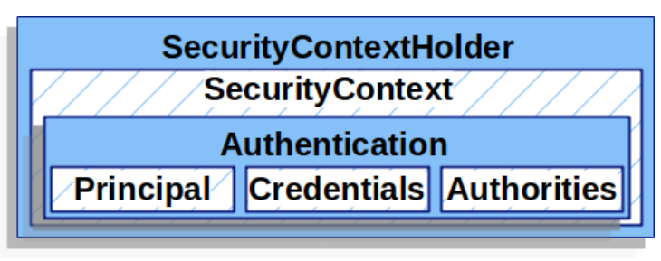
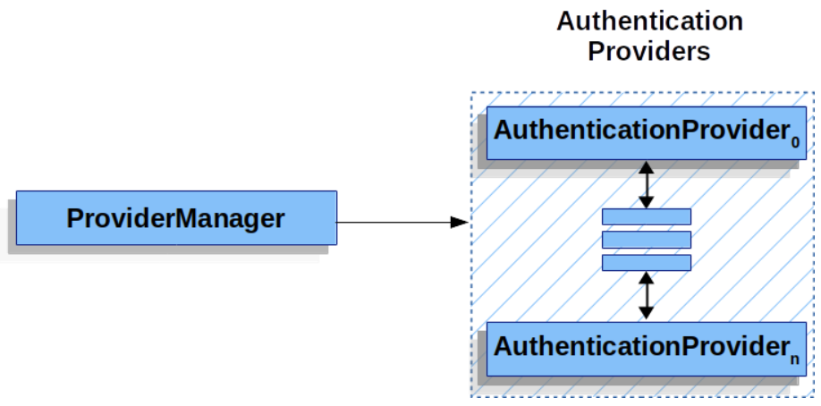
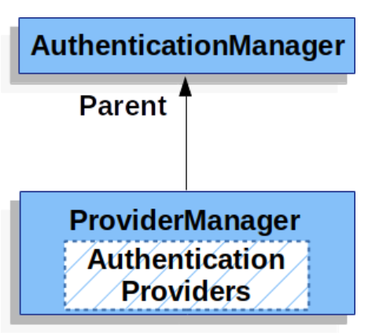
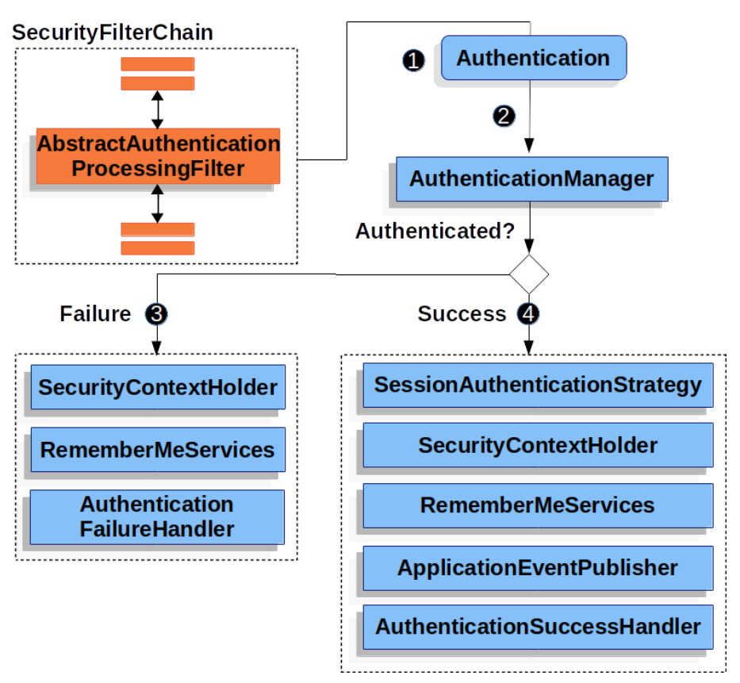

# Authentication Architecture

本章节的讨论扩展了 [Servlet Security: The Big Picture](https://docs.spring.io/spring-security/reference/servlet/architecture.html#servlet-architecture) ，描述在 Servlet 认证中使用的 Spring Security 的主要架构组件。如果你想要了解解释这些部分如何组合在一起工作的具体流程，可以查看 [认证机制]() 中提到的特定章节。

- [SecurityContextHolder](#securitycontextholder) - Spring Security 使用 `SecurityContextHolder` 存储已认证用户的细节。

- [SecurityContext](#securitycontext) - 从 `SecurityContextHolder` 中获取，包括目前已认证用户的 `Authentication` 。

- [Authentication](#authentication) - 可以作为 AuthenticationManager 的输入，提供用户用来认证的 credentials 或者从 `SecurityContext` 中获取的现有用户。

- [GrantedAuthority](#grantedauthority) - 表示在 `Authentication` 中授予 principle 的权限（i.e. roles, scopes, etc.）。

- [AuthenticationManager](#authenticationmanager) - 定义了 Spring Security 的过滤器如何执行认证。

- [ProviderManager](#providermanager) - `AuthenticationManager` 最常见的实现。

- [AuthenticationProvider](#authenticationprovider) - 提供给 `ProviderManager` 使用来执行某种特定的认证。

- [Request Credentials with `AuthenticationEntryPoint`](#request-credentials-with-authenticationentrypoint) - 用于从客户端请求 credentials（i.e. 重定向到一个登录页面，发送一个 `WWW-Authenticate` 响应，etc.）。

- [AbstractAuthenticationProcessingFilter](#abstractauthenticationprocessingfilter) - 用于认证的一个基本的过滤器。这个过滤器也可以让我们了解认证的 high level 流程以及各个部分如何一起协作。

## SecurityContextHolder

`SecurityContextHolder` 是 Spring Security 认证模型的核心，它包含 [SecurityContext](#securitycontext) 。

<div style="text-align:center">

</div>

Spring Security 使用 `SecurityContextHolder` 存储已认证用户的细节。Spring Security 不关系 `SecurityContextHolder` 是如何填充的。如果它包含一个值，那么它将会被当作当前已经通过认证的用户。

证明一个用户已经通过了认证的最简单的方法就是直接设置 `SecurityContextHolder` 。

*Example 1. Setting `SecurityContextHolder`*
```java
SecurityContext context = SecurityContextHolder.createEmptyContext(); // 1
Authentication authentication =
    new TestingAuthenticationToken("username", "password", "ROLE_USER"); // 2
context.setAuthentication(authentication);

SecurityContextHolder.setContext(context); // 3
```

1. 我们从创建一个空的 `SecurityContext` 开始。记住，创建一个新的 `SecurityContext` 实例而不要使用 `SecurityContextHolder.getContext().setAuthentication(authentication)` ，因为这样可以避免多线程之间的竞争。
2. 然后，我们创建一个新的 [Authentication](#authentication) 对象。Spring Security 并不关心哪种的 `Authentication` 实现被设置在 `SecurityContext` 中。本示例中我们使用 `TestingAuthenticationToken` ，因为它很简单。生产环境中更常见的场景是使用 `UsernamePasswordAuthenticationToken(userDetails, password, authorities)` 。
3. 最后，我们把 `SecurityContext` 放入 `SecurityContextHolder` 中。Spring Security 将使用该信息来完成[授权](https://docs.spring.io/spring-security/reference/servlet/authorization/index.html#servlet-authorization)。

如果你想要获取已认证 principle 的信息，可以通过访问 `SecurityContextHolder` 来实现：

*Example 2. Access Currently Authenticated User*
```java
SecurityContext context = SecurityContextHolder.getContext();
Authentication authentication = context.getAuthentication();
String username = authentication.getName();
Object principal = authentication.getPrincipal();
Collection<? extends GrantedAuthority> authorities = authentication.getAuthorities();
```

默认情况下 `SecurityContextHolder` 使用一个 `ThreadLocal` 来存储这些详细信息，也就意味着在同一个线程中的方法总是可以拿到 `SecurityContext` ，即使 `SecurityContext` 没有作为参数在这些方法中显示地传递。如果在处理当前 principle 的请求之后仔细清理了线程，那么以这种方式使用 `ThreadLocal` 是非常安全的。Spring Security 的 [FilterChainProxy](https://docs.spring.io/spring-security/reference/servlet/architecture.html#servlet-filterchainproxy) 可以确保 `SecurityContext` 总是被清除。

一些应用程序可能会由于处理线程的特定方式，并不适合使用 `ThreadLocal` 。例如，Swing 客户端可能希望 Java 虚拟机中的所有线程都使用相同的 security context 。可以在启动时配置 `SecurityContextHolder` 的策略来指定你希望如何存储 context 。对于一个独立的应用程序，可以使用 `SecurityContextHolder.MODE_GLOBAL` 策略；有的应用程序可能希望由安全线程派生的线程也使用相同的安全标识，这可以通过使用 `SecurityContextHolder.MODE_INHERITABLETHREADLOCAL` 实现。有两种方式可以改变默认的 `SecurityContextHolder.MODE_THREADLOCAL` 策略：设置系统属性或调用 `SecurityContextHolder` 的静态方法。大部分应用程序不需要改变默认值，但是如果你需要那么做，参考有关`SecurityContextHolder` 的 Javadoc 。

## SecurityContext

`SecurityContext` 从 [SecurityContextHolder](#securitycontextholder) 中获取，并且包括一个 [Authentication](#authentication) 对象 。

## Authentication

在 Spring Security 中，`Authentication` 有两个主要的作用：
- 作为 [`AuthenticationManager`](#authenticationmanager) 的输入，提供用户用于认证的 credentials 。该场景下，`isAuthenticated()` 方法返回 `false` 。
- 代表目前已认证的用户。目前的 `Authentication` 可以从 [SecurityContext](#securitycontext) 中获取。

`Authentication` 包括：
- principal - 识别用户。当使用用户名/密码进行身份验证时，这通常是一个 [`UserDetails`](https://docs.spring.io/spring-security/reference/servlet/authentication/passwords/user-details.html#servlet-authentication-userdetails) 实例。

- credentials - 通常是一个密码。在许多用例中，会在用户完成认证后清除 credentials 以防止密码泄露。

- authorities - [`GrantedAuthority`](#grantedauthority)s 是用户被授予的 high level 许可。一些简单例子包括 roles 或 scopes 。

## GrantedAuthority

[`GrantedAuthority`](https://docs.spring.io/spring-security/site/docs/5.7.3/api/org/springframework/security/core/GrantedAuthority.html)s 是用户被授予的 high level 许可。一些简单例子包括 roles 或 scopes 。

可以通过 `Authentication.getAuthorities()` 方法来获取 `GrantedAuthority`s ，该方法提供一个包含 `GrantedAuthority` 对象的集合。显而易见，`GrantedAuthority` 是授予 principle 的权限。这些权限通常是 "roles" ，例如 `ROLE_ADMINISTRATOR` 或 `ROLE_HR_SUPERVISOR` 。后续会为 web 授权，方法授权以及 domain 对象授权配置这些角色。Spring Security 的其他部分能够解释这些权限，并预期它们会出现。当使用基于用户名/密码的身份验证时，`GrantedAuthority`s 通常由 [`UserDetailsService`](https://docs.spring.io/spring-security/reference/servlet/authentication/passwords/user-details-service.html#servlet-authentication-userdetailsservice) 提供。

通常 `GrantedAuthority` 对象是应用程序范围的权限，他们并不特定于某一个给定的 domain 对象。你不太可能有一个 `GrantedAuthority` 表示 `Employee` 54 号对象的权限，因为如果有数千个这样的权限，内存将很快被耗尽（或者，至少会导致应用程序花费很长时间来验证用户）。当然，Spring Security 是专门设计来处理这一常见需求的，但你应该使用项目的 domain 对象安全功能来实现这一目的。

## AuthenticationManager

`AuthenticationManager` 是定义了 Spring Security 的过滤器如何执行认证的 API 。然后，返回的 `Authentication` 被调用了 `AuthenticationManager` 的 controller (i.e. Spring Security’s Filters) 设置在了 SecurityContextHolder 中。如果你没有和 *Spring Security’s Filters* 集成，你可以直接设置 `SecurityContextHolder` ，不需要使用 `AuthenticationManager` 。

你可以任意实现 `AuthenticationManager` ，但最常见的实现是 `ProviderManager` 。

## ProviderManager

`ProviderManager` 是最常被使用的 `AuthenticationManager` 。`ProviderManager` 将职责委托给一系列的 [`AuthenticationProvider`](#authenticationprovider)s ，每个 `AuthenticationProvider` 有机会表明认证是成功还是失败，或是表明它不能做决定并允许一个下游的 `AuthenticationProvider` 来决定。如果没有一个配置的 `AuthenticationProvider`s 可以完成认证，则判定认证失败并抛出一个 `ProviderNotFoundException` 。这是一个特殊的 `AuthenticationException` ，表明 `ProviderManager` 不支持传递给它的 `Authentication` 类型。

<div style="text-align:center">

</div>

实践中，每个 `AuthenticationProvider` 知道如何执行一种特定类型的认证。例如，一个 `AuthenticationProvider` 可能可以验证用户名/密码，而另一个可以验证一个 SAML 断言。这允许每个 `AuthenticationProvider` 完成一种特别类型的认证，同时支持多种类型的认证，并且只暴露一个 `AuthenticationManager` bean 。

`ProviderManager` 还允许配置一个可选的父 `AuthenticationManager` ，用于在没有 `AuthenticationProvider` 可以执行认证的情况下咨询它。这个父类可以是任何类型的 `AuthenticationManager` ，但通常是一个 `ProviderManager` 实例。

<div style="text-align:center">

</div>

事实上，可能有多个 `ProviderManager` 共享一个相同的父 `AuthenticationManager` 。这在有多个 [`SecurityFilterChain`](https://docs.spring.io/spring-security/reference/servlet/architecture.html#servlet-securityfilterchain) 实例的场景中比较常见，这些 `SecurityFilterChain` 有一些相同的认证机制（共享的父 `AuthenticationManager` ），但也有一些不同的身份验证机制（不同的 `ProviderManager` 实例）。

默认情况下，`ProviderManager` 将尝试从认证成功的请求返回的 `Authentication` 对象中清除任何敏感的 credentials 信息。这可以防止像密码这样的信息在 `HttpSession` 中保留的时间超过必要的时间长度。但是这样一来，在你使用用户对象缓存时（例如，为了提高无状态应用程序的性能）可能会引起问题。如果 `Authentication` 包含对缓存中对象（例如 `UserDetails` 实例）的引用，并且该对象的 credentials 已被删除，那么将不再可能根据缓存的值进行认证。如果你使用缓存，就需要考虑到这一点。一个显而易见的解决办法就是在清除 credentials 之前复制 `Authentication` 对象，在缓存的实现中，或者在创建了该 `Authentication` 对象的 `AuthenticationProvider` 中。或者，你可以禁用 `ProviderManager` 上的 `eraseCredentialsAfterAuthentication` 属性。更多信息参阅 [Javadoc](https://docs.spring.io/spring-security/site/docs/5.7.3/api/org/springframework/security/authentication/ProviderManager.html) 。

## AuthenticationProvider

可以有多个 `AuthenticationProvider` 被注入到 `ProviderManager` 中。每个 `AuthenticationProvider` 执行一种特定类型的认证。例如，`DaoAuthenticationProvider` 支持基于用户名/密码的认证，而 `JwtAuthenticationProvider` 支持对 JWT 令牌的认证。

## Request Credentials with AuthenticationEntryPoint

`AuthenticationEntryPoint` 用于发送从客户端请求 credentials 的 HTTP 响应。

有时，客户端会主动包含用户名/密码等 credentials 来请求资源，在这些情况下，Spring Security 不需要提供从客户端请求 credentials 的 HTTP 响应，因为它们已经包含在其中。

有时，客户端会向被保护的资源发出未经身份验证的请求，在这些情况下，`AuthenticationEntryPoint` 的实现用于从客户机请求 credentials 。`AuthenticationEntryPoint` 的实现可能执行 [重定向到登录页面](https://docs.spring.io/spring-security/reference/servlet/authentication/passwords/form.html#servlet-authentication-form)（Form Login），用 [WWW-Authenticate](https://docs.spring.io/spring-security/reference/servlet/authentication/passwords/basic.html#servlet-authentication-basic) 报头进行响应（Basic Authentication）等。

## AbstractAuthenticationProcessingFilter

`AbstractAuthenticationProcessingFilter` 是用于验证用户 credentials 的基本 `Filter` 。在验证 credentials 之前，Spring Security 通常使用 `AuthenticationEntryPoint` 请求 credentials 。然后，`AbstractAuthenticationProcessingFilter` 可以验证提交给它的任何认证请求。

<div style="text-align:center">

</div>

1. 用户提交他们的 credentials 时，`AbstractAuthenticationProcessingFilter` 会从需要认证的 `HttpServletRequest` 创建一个 `Authentication` 对象。要创建的 `Authentication` 对象的类型取决于 `AbstractAuthenticationProcessingFilter` 的子类。例如，`UsernamePasswordAuthenticationFilter` 会根据 `HttpServletRequest` 中提交的用户名和密码创建一个 `UsernamePasswordAuthenticationToken` 。

2. 接下来，`Authentication` 会被提交给 `AuthenticationManager` 进行认证。

3. 如果认证失败，则：
    - 清理 `SecurityContextHolder` 
    - 调用 `RememberMeServices.loginFail` ，如果没有配置 remember me 功能，此步骤不会做任何操作
    - 调用 `AuthenticationFailureHandler`

4. 如果认证成功，则：
    - `SessionAuthenticationStrategy` 会收到新登录的通知
    - 将 `Authentication` 放在 `SecurityContextHolder` 中，稍后，`SecurityContextPersistenceFilter` 会将该 `SecurityContext` 保存到 `HttpSession` 中
    - 调用 `RememberMeServices.loginSuccess` ，如果没有配置 remember me 功能，此步骤不会做任何操作
    - `ApplicationEventPublisher` 发布一个 `InteractiveAuthenticationSuccessEvent`
    - 调用 `AuthenticationSuccessHandler`